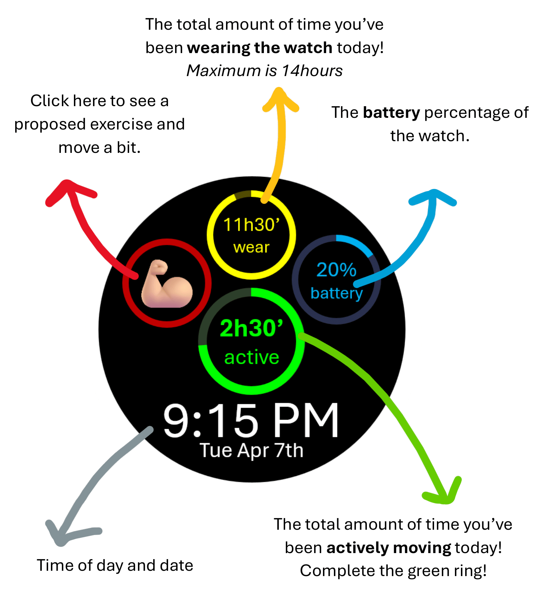

# Diversify Watch Face 

> I created a watch face for Samsung Wear OS (Android) enhancing user-experience and leveraging human factors design to digital health and stroke rehabilitation. It’s a clean, complication-driven face (Android Watch Face Format XML + custom providers) that supports an app for counting upper-extremity movement. A watch face is the home screen of a smartwatch. On Wear OS, it renders time/date and can surface **live data “complications”**; small UI regions powered by system or app-provided data sources (steps, goals, battery, custom metrics, etc.). A well-designed watch face lets users glance key information with **zero navigation** and **near-zero cognitive load**.

---

## Preview



---

## Why complications? (And why this matters for stroke recovery)

Complications let us show **one or two critical metrics** with strong visual affordances, instead of burying information in menus. For people in stroke rehabilitation, this is especially important:

* **Good UI:** fewer items, bigger type, high contrast.
* **Progress cues:** **RANGED_VALUE** progress rings provide immediate “how far am I?” feedback, which has been proven to be beneficial in rehabilitation.
* **Plain language labels:** **SHORT_TEXT** lets us annotate the metrics (“active”, “wear time”, “battery”).
* **Ambient clarity:** simplified elements in ambient mode reduce visual clutter while preserving status and saving battery.


---

## Complications in this watch face
This repo’s example emphasizes: **one primary progress ring**, **two supporting rings**, **one circular label**, and large, readable time/date.

* `watchface.xml` — a complete **Watch Face Format** XML that defines:

    * A **RANGED_VALUE** progress ring (e.g., “active movement minutes”, “therapy goal”, etc.).
    * A **SHORT_TEXT** left complication (e.g., emoji + label such as “exercises”) which is tappable.
    * A **RANGED_VALUE** top complication for **wear time** (minutes/hours on the wrist).
    * A **RANGED_VALUE** right complication for **battery** indicator.
    * Large, legible **digital time** and **date**.
    * Color **theme configuration** users can select.

You can plug in your own complication providers or use the defaults included in /providers.

### RANGED_VALUE
* Numeric value between **min** and **max**; perfect for goals and progress. Rendered using circular progress rings with labels, plus time value readouts (e.g., “2h15’”).
* **Where is it used?**
    * **Slot 0**: **Main progress** ring (**providers/MyProgressComplicationProviderService**).
    * **Slot 2**: **Wear time** ring (**providers/MyWearTimeComplicationProviderService**).
    * **Slot 3**: **Battery** ring (**System: WATCH_BATTERY** by default).

### SHORT_TEXT
* Brief text string (optionally with an icon/emoji). Rendered using a centered emoji/text inside a slim ring, plus a bottom caption.
* **Where is it used?**
    * **Slot 1**: Left emoji/text that opens proposed exercises (**providers/MyComplicationProviderService**).
    * **Slot 4**: Restart/status text (**providers/MyServiceAliveCheckComplicationProviderService**) inside a pressable circular region.

> The XML already specifies **default providers** so the face remains useful even without your custom services (e.g., steps, battery).

---

## Health-oriented UI principles baked into the XML

* **Single dominant metric:** A larger ring (Slot 0) makes the primary health goal unmistakable.
* **Ambient mode simplification:** Rings/text fade or move in ambient for clean low-power glanceability.
* **Color themes:** A light set of curated palettes supports contrast preferences and situational lighting.
* **Tap regions sized generously:** Interactive/centered areas (e.g., Restart) are easy to hit.

---

## File layout

```
├── watchface.xml                # The Watch Face Format definition (this repo’s core). Inside the project --> app/watchface/src/main/res/raw
├── README.md                    # This file
├── docs/
│   ├── watchfaceinstructions.png
│   ├── watchface_ambient.png
└── providers/                   # My kotlin complication providers code
    ├── ComplicationProviderService.kt 
    ├── MyProgressComplicationProviderService.kt
    ├── MyWearTimeComplicationProviderService.kt
    └── MyServiceAliveCheckComplicationProviderService.kt
```

---

## How to plug in your data
> Take a look at my providers. You can change them to access your own datasets. I am using Room datasets.
* **MyProgressComplicationProviderService** → emits a `RANGED_VALUE` (e.g., active minutes toward goal).
* **MyWearTimeComplicationProviderService** → emits a `RANGED_VALUE` derived from daily “watch-worn” minutes.
* **MyComplicationProviderService** → emits a `SHORT_TEXT` (emoji or brief label).
* **MyServiceAliveCheckComplicationProviderService** → emits status text (e.g., “RESTART”/“ALIVE”) as `SHORT_TEXT`.

---

## The .xml CODE
* **Face basics:** 450×450 **DIGITAL** watch face.
* **Themes:** User-selectable palettes via `themeColor`; reference colors as `[CONFIGURATION.themeColor.N]`.
* **Clock & date:** Shows date and time, with a thinner font in ambient.

**Useful to know**
* `<UserConfigurations>` with `ColorConfiguration` (theme options).
* `<ComplicationSlot>` blocks for Slots **0..4** with **supportedTypes** set to `RANGED_VALUE` or `SHORT_TEXT`.
* `<DefaultProviderPolicy>` pointing to your custom providers (and safe system fallbacks).
* `<Variant mode="AMBIENT">` sections to simplify visuals when the device is in ambient mode.
* `<DigitalClock>` and date **PartText** for time/date layers rendered last (on top).
* `when=[COMPLICATION.HAS_DATA]` gates drawing. The providers decide if the complication is shown or not.
* **BoundingOval** defines circular clip/tap regions (recommended for ring/round UI).
* **Transform endAngle** maps normalized value → 0–360°.
* `"%sh%s'"` template converts total minutes → hours:minutes.
  
---

## License

MIT © 2025 Guillem Cornella — see the [LICENSE](LICENSE) file for details.

---

## Citation / Acknowledgments
If you use this code or ideas, please cite this repo or my Google Scholar.

```bibtex
@software{cornella-barba2025diversify,
  author  = {Cornella-Barba, Guillem},
  title   = {Diversify Watch Face: A complication-driven Wear OS face for stroke rehabilitation},
  year    = {2025},
  url     = {https://github.com/gcornella/Diversify_WatchFaceComplications},
  version = {v1.0.0}
}
```

---

### Appendix: Slot Map


```bibtex
| Slot | Type         | Purpose          | Default Provider                                 |
| ---- | ------------ | ---------------- |--------------------------------------------------|
| 0    | RANGED_VALUE | Primary progress | `MyProgressComplicationProviderService`          |
| 1    | SHORT_TEXT   | Emoji/Label left | `MyComplicationProviderService`                  |
| 2    | RANGED_VALUE | Wear time        | `MyWearTimeComplicationProviderService`          |
| 3    | RANGED_VALUE | Battery          | System `WATCH_BATTERY`                           |
| 4    | SHORT_TEXT   | Restart/Status   | `MyServiceAliveCheckComplicationProviderService` |
```
---

